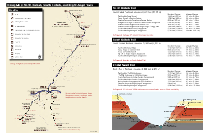

<head>
<meta charset="UTF-8">
<meta name="viewport" content="width=device-width, user-scalable=yes">
<title>The Geology of the North Kaibab Trail - by Brandon Rhodes</title>

</head><body>

# The Geology of the North Kaibab Trail

by [Brandon Rhodes](https://rhodesmill.org/brandon/)

⚒

I’ve written this
to be the article that I wish I myself could have read
before my first hike up the Grand Canyon’s NKT.

Typical descriptions of the NKT are quick to mention
its fatal summer temperatures,
its high altitude trailhead on the North Rim,
and its 5,761 feet of elevation gain
that require hikers to climb more than a vertical mile
from the Colorado River.

But the trail presents yet another challenge that, alas,
is too rarely mentioned:

Its devastating geology.

The hiker who starts up the NKT
possessed of only a simple South Rim day-hike geology
will soon find themselves adrift and disoriented,
lost in a wide wilderness of unfamiliar rock —
when they had instead imagined themselves
making a steady climb
through the Canyon’s familiar cliffs and benches.

This article, therefore, is written for a “BAH”
(whom we are going to be too kind to name)
who has become familiar with the Grand Canyon’s most famous strata
through day hikes from the South Rim,
and who now fancies himself ready for the NKT.
He knows that a rim-to-rim day hike
carries risks at the beginning of June,
but two nephews are determined to make the attempt
and it’s agreed that someone familiar with the Canyon should accompany them.

## Order and Chaos

The BAH will already be familiar
with the Canyon’s two most famous strata:
the high white Coconino cliffs whose sheer and dizzy precipice
dominates the view from so many South Rim overlooks,
and the mighty Redwall
whose height can be difficult to gauge from the rim
but whose cliffs stand at least a hundred feet taller than the Coconino.

When a hiker looks back south from Plateau Point —
the most remote inner-canyon overlook
to which the
[National Park brochure](https://www.nps.gov/grca/planyourvisit/upload/brightangeltrail.pdf)
dares to countenance a day hike —
the $Pc and $Mr are the most prominent features
of the South Rim’s towering ramparts:

https://lh3.googleusercontent.com/pw/ACtC-3f5sygJsXwDl99XeiA3lj2p8cAlS0Fey6hDyZ_lChCNzR0zmJF0RnH0v8eU7EjhCm86ZwkTtXyt8m7cjkk1Nktswrtlaa28tPbXUCVGfQAUmC4paWjYF7wf9uAfyZa6etx7OaSBEk9O4UgkLPHrLmYJ=w790-h529-no?authuser=0
Pc
Mr
Ct

*The view back toward the South Rim from Plateau Point.*

But what rock is the hiker himself standing on at PP?

PP stands atop the Canyon’s deepest layer of horizontal rock:
the $Ct.
Like the Coconino and Redwall,
the Tapeats are a cliff-forming layer,
as the hiker can see by turning east to look across Pipe Creek.
There, a fine section of Tapeats cliffs
caps the far wall of Pipe Creek canyon:

https://lh3.googleusercontent.com/pw/AM-JKLUm5sv17J3qPxJ4AN09vjc9CIYHZDDulV0f7jAR9ykUa40oMTIhM5hl7TxLQ3aTGtUNp8GhCF0nAkUVsSt9P9-tnPOJyX_jclV7sOag36ICb7zBnZNDDERmua3yjTjEvExeniWh2lafoQj4Xy9RJi1EOQ=w1188-h794-no
Pc
Mr
Mr
Ct
Ct
Xbr

*The view east from PP across Pipe Creek.*

In the distance at the photo’s left,
you can see a similar line of $Ct cliffs
arrayed along the top of Upper Granite Gorge
through which the Colorado River itself runs.

There are no further horizontal layers below the Tapeats,
only a twisting chaos of ancient metamorphic rock.
In the photo above you can see a steep slope of $Xbr
falling away toward Pipe Creek,
but the Brahma is only one of several
granite, schist, and gneiss formations
that together form the thousand-foot walls of both Upper Granite Gorge
and its side canyons like Pipe Creek.

These are the Grand Canyon’s “basement rocks”
and they are so much older than the Tapeats
that geologists have given the name “the Great Unconformity”
to the contact between them.

Thus the BAH returns from PP to the South Rim
with a tidy Grand Canyon diagram in his head:
a colorful layer cake of horizontal strata
standing atop a massed chaos of older rock.
The Canyon’s structure almost seems to have been inspired by cinema,
where bright heights of order and rationality
are always underlain by dark hidden depths of primæval chaos.

This emotional contrast
is only heightened by the National Park brochures,
which always confine day hikers to the horizontal strata.
Only there will they promise the hiker some hope of safety.
But they make clear
that heat, dehydration, exhaustion, and even death itself
stand ready to stalk the day hiker
who would dare pass beneath the Tapeats
and descend into the twisted maelstrom
of Precambrian rocks beneath.

 
<i>Here’s the 2-page
<a href="https://www.trans-canyonshuttle.com/uploads/images/corridor_map.pdf">trail map</a>
(PDF) the hikers followed back in 2014.
The Park Service has switched to a
<a href="https://www.nps.gov/grca/planyourvisit/upload/intro-bc-hike.pdf">longer
brochure</a> (PDF)
with ample warnings about the hike
and also a more informative map.</i>

The BAH therefore envisions a rim-to-rim hike with the nephews
in schematic terms.
First comes a quick descent of the SKT
with all the familiar strata serving as mileposts.
Then a plunge into the Precambrian depths
that will take them across the Colorado River.
Finally, like a diver rising back to the surface,
they will follow the NKT back up into the Tapeats
and their feet will once again stand on familiar rock.
From there the trail will wind past
the Redwall and then the Coconino,
whose cliffs will stand sentinel to measure the hikers’ progress
as they climb — weary but triumphant — to the North Rim.

## Loomings

And so the hiker and the nephews
start down the SKT before dawn.
It’s June 7, 2014.
The morning is cool, the hike is downhill, and they make excellent time.

To its credit,
the Grand Canyon doesn’t wait
until it has lured the BAH
several dangerous miles north of the Colorado River
before proclaiming that it intends a more complex geology
than the hiker is prepared for.
In fact,
it’s while the hiker is still south of the River
that the Canyon unveils a surprising new stratum,
just as the hikers have finished their descent through the Tapeats:

https://lh3.googleusercontent.com/pw/AM-JKLXeSgnE7MqQSDaz_cPUbhvNHmqEbvs6aSnQcfvb7MwQ7YOUg6FE5i0E5HB9Z65J_weffvN_ers5EgnJQuip9GRqT5xoBSE7a-ISS9l843Joqg-RFo1mwW_Bd8C5ylBK4RHMOSZvg8Ewh4la8yZSh_0A9Q=w1078-h720-no?authuser=0
Ct
Ct
Xbr
Xgr
Yh

*The startling $Yh on the SKT at Panorama Point.*

In the distance, across the Colorado River,
the geology is conventional and familiar:
a picket of $Ct cliffs caps $Xbr and $Xgr basement rocks,
just as the BAT has taught the hiker to expect.
But what’s going on over on this side of the river?
The SKT approaches Panorama Point and its lonely slab of $Ct
across a surprising shallow slope of loose orange stone.

If only the hiker stopped to notice!
But he and the two nephews are at full tilt downhill,
pushing to make several more miles while the morning is still cool.

They do, at least, notice the change in the trail.
The awkward muddy mule-sized stairsteps
on which the SK descends the Tapeats
suddenly give way to this long gentle slope.
But it doesn’t occur to them to ponder
the unfamiliar orange stone which provides them
with such a gentle grade.

Shouldn’t the Tapeats have been followed by basement rock instead?

Since they missed it the first time,
the Canyon offers a second outcrop
of the same anomalous orange stone.
The hikers cross the Colorado River at the bridge,
refill with water at BA Campground,
and start hiking up the NKT along BA Creek.
Once they pass the cluster of
[famous stone cabins](https://www.nps.gov/grca/learn/photosmultimedia/colter_phantom_photos.htm)
that make up Phantom Ranch
and climb into the empty valley above it,
the orange stone reappears high in the cliffs on their left:

https://lh3.googleusercontent.com/pw/AM-JKLW4_YtvyEqMWcIVCbTW2TUk25Dh4JxCyFxDOqaA7Wu9SfIb6NQRfBwdo3tXOD_Elwl0SrzsYrHkLnHx8WJm-_24uiBkZF1VFojYWCxRqsV6fSP1E03GUifPamPrVbWm0ALUZzy5xK9w4qHh4jkmeTjwvg=w790-h529-no?authuser=0
Ct
Yh
Xr
Xr

*The view west across BA Creek ½ mile north of Phantom Ranch,
where an outcrop of $Yh stands high in the cliffs.*

It might take a moment
for your eyes to calibrate the scale of this image.
The $Ct cliffs atop the canyon wall
stand more than a thousand feet above BA Creek at the bottom —
you are looking at nearly a vertical quarter mile of rock.
The creek, though it’s a full twenty feet wide,
is barely visible as a slender brown-green ribbon
running along the base of the cliffs.
The NKT alongside it is invisible,
though you might spot the Clear Creek Trail
curving toward the photographer
across the near side of the valley floor.

It’s nearly 9am as the hiker and nephews
reach this section of the NKT.
With their attention on the trail in front of them
and their eyes shaded by hat brims,
they never even see the rusty orange outcrop high in the cliffs above.
They see only the rock that’s level with the trail:
rugged slopes of $Xr,
a basement rock of exactly the sort that the BAH expects.
At this point, his mental Grand Canyon schematic remains unchallenged.

## B’s DD

It’s our astounding good fortune
that George H. B
has chosen to lavish this part of the Canyon
with so much attention
on his magisterial
[Geologic Map of the Grand Canyon 30′×60′ Quadrangle, Coconino and Mohave Counties, Northwestern Arizona](https://pubs.usgs.gov/imap/i-2688/),
available from the USGS
as a free [PDF](https://pubs.usgs.gov/imap/i-2688/i-2688.pdf)
or a [printed map](https://store.usgs.gov/product/28860).
B singles out BA Canyon for special treatment:
of the four cross sections that supplement his map,
CC runs directly athwart BA Creek
and DD runs alongside the creek for more than eight miles —
all the way from the Colorado River to the Manzanita Rest Area.

For this article
I’ve divided Billingsley’s cross section DD into three diagrams,
simplified its notations,
and added a trace showing the elevation of the NKT
as it climbs the Canyon’s layers.

Here are the first three miles of B’s cross section:

triptych1.png

legend-Cba.png

legend-Ct.png

legend-Ys.png

legend-Yh.png

legend-Yb.png

legend-Xgr.png

legend-Xv.png

legend-Xbr.png

legend-Xr.png

You’ll notice that geologists prefix each strata’s abbreviation
with a letter for the age it belongs to,
like X for the ancient basement rocks,
Y for more recent Precambrian rocks,
and C with a little dash through it for the Cambrian period.
(If you’re interested, here’s a
[complete list](https://ngmdb.usgs.gov/fgdc_gds/geolsymstd/fgdc-geolsym-sec32.pdf)
from the Federal Geographic Data Committee.)

A few notes about the these diagrams:

* B’s cross section
  **exaggerates the vertical dimension** by a factor of two,
  so strata look taller
  and the contacts between them look steeper
  than in real life.

* The **rugged diagonal line** shows the elevation of the NKT.
  The strata that are faintly visible below the line
  are hidden underground beneath the trail.
  The strata standing bright above the line
  should be visible in the cliffs beside the trail.

* I’ve added mileposts along the NKT.
  These measure **trail miles**,
  not miles as the crow flies,
  so the mileposts bunch closer together in the first diagram
  where the trail does a lot of winding.
  Note that Mile 0.0 isn’t at the Colorado River
  but at BA Campground,
  to match the National Park Service’s mileages.

* B’s cross section DD doesn’t run along the NKT itself
  but **parallel to the trail a few thousand feet to the west**.
  Strictly speaking,
  these diagrams don’t show how the strata
  are exposed on the cliffs along the trail,
  but how they’re arranged
  deep inside the hill on the (northbound) hiker’s left.
  This causes a few small differences,
  but none that will concern us here.
  (South of the river, for example,
  the cross section misses the exciting $Yh at Panorama Point
  and instead intersects the normal $Xbr basement rock to its west.)

So,
now that we’ve brought B alongside as our geologist,
what do we learn about this mysterious orange stone?

First, its name: the $Yh.

Second,
the diagram reveals why we’re seeing isolated outcrops of Hakatai
instead of the kind of long continuous layer
for which the Grand Canyon is famous:
extensive faulting between the Colorado River and Phantom Creek
has shattered the once-continuous strata into separate blocks.
Each thick vertical line in the diagram is a fault,
some of which have pulled quite different rocks
right next to each other.

Finally,
we learn that even though the Hakatai
is the only new layer we’ve noticed in the photographs,
it’s not alone.
It’s accompanied by two other layers
that, when they’re present, always occur in the same order:
the $Yb on bottom,
$Yh in the middle,
and $Ys on top.

It turns out that these layers
all belong to the “Grand Canyon Supergroup” —
the only geologic ensemble named after the Grand Canyon itself.

The BAH never expected to meet the Supergroup.
After all,
many of the National Park’s
[geology illustrations](https://www.nps.gov/articles/images/pop-up-yardstick.jpg)
put the Supergroup entirely underground.
This naturally leads the reader to suppose
that while these deeply buried layers might be of concern
to a miner sinking a shaft,
or to an engineer digging a well,
they can be safely ignored by anyone walking about aboveground.

Not only have we already seen that this impression is mistaken,
but it’s going to become more mistaken as the day proceeds.

## Into the Great Wide Open

After passing Phantom Ranch,
the NKT leads the hikers into “The Box” —
the deep and narrow chasm
that BA Creek has carved for itself through the basement rock.
The sky is narrower here.
The creek meanders so sharply over these 3½ miles
that at a few spots the hikers are actually walking back south.
It’s often impossible to see even a tenth of a mile ahead.
This confined space has a reputation
for deadly summer temperatures —
but early on this June morning,
the hikers are enjoying the shade from the Box’s high walls.

Then, right around Mile 4.0, the Box comes to an end.

The hikers step out into full sunshine
and find themselves looking up a wide sundrenched valley
that slopes up out of sight ahead of them.
The BAH is bewildered.
What’s a broad river valley
doing here in the middle of the Grand Canyon?

The valley’s dimensions are difficult to gauge
from where the hikers stand at its lower end,
but the valley is more than a third of a mile wide
and stretches uphill for a full three miles
before starting to narrow again past Cottonwood Campground.
BA Creek flows down its center towards them,
nourishing a slender ribbon of green foliage.
But the rest of the valley is a shimmering desert of shrub and stone.

https://lh3.googleusercontent.com/pw/AM-JKLWEZsKeJ922CNdZAbysUkDa9hpiJbBhgvbaJnAGdIzuj5h8PQD_wh4o_5G_HwY2M73f0xY4ZiUcrS60ZtOy-Hdiqpb2MFL8MBACqo_H8tKrWvLoqfVPyklOkE1peeU0exWyCKMyGvUhkhSqAN7X_Z-ppQ=w619-h619-no
South Rim
↓ Colorado River
↓ The Box
↓ Mile 4.0
↓ Ribbon Falls
↓ Cottonwood CG

*The wide valley of BA Creek between Mile 4.0 and Cottonwood Campground,
viewed looking back south from the North Rim.*

The Grand Canyon’s usual rule
is that once a creek has cut all the way through the Tapeats,
it hits implacable granites and schists
that force it to carve a sinuous narrows —
like the Box.
Like Pipe Creek at the bottom of the BAT.
Like any number of other creeks along Upper Granite Gorge,
even though the BAH hasn’t met them yet:
Clear Creek, Grapevine, Hance.

But here,
BA Creek has plainly breached the Tapeats —
they’re in plain view as a row of high cliffs
high atop each side of the valley —
yet it hasn’t had to carve a narrows.
Instead,
the creek has been able to furnish itself with a wide spacious valley
and with a streambed
that runs nearly straight along its eponymous fault.

Why is the Canyon’s substructure so weak here?
How has the creek been able to hold its course?

triptych2.png

legend-Mr.png

legend-Dtb.png

legend-Cm.png

legend-Cba.png

legend-Ct.png

legend-Ys.png

legend-Yh.png

legend-Yi.png

legend-Yb.png

legend-Xgr.png

legend-Xr.png

B’s cross section reveals the answer:
the bottom of this valley isn’t basement rock at all!
It’s the same series of Supergroup strata
that could be glimpsed above the Colorado River,
from the $Yb
through the $Yh
to the $Ys.
Down by the river,
they stood only as faulted blocks or isolated outcrops.
But here they’ve returned as a deep stack of long continuous strata.

Reading the cross section from left to right,
we see that even as the hikers
were at Mile 3.0 winding north
through the Box’s $Xgr,
the Supergroup started to reappear in the cliffs above them.
For more than a mile
its strata have been slowly descending toward the trail.
And here, just past Mile 4.0,
the $Yb has finally reached the valley floor.

On the diagram,
it’s easy enough to see
where the trail’s rugged diagonal line
leaves the $Xgr basement rock that the diagram has colored orange
and enters the $Yb that’s colored lime green.
On the real trail,
the contact between the two layers is hidden
somewhere beneath the trail’s cobbles.
But when the hikers reach that invisible boundary,
they step off the Canyon’s basement rock
and up into the Bass Formation that founds the Supergroup.

The BAH guesses none of this
as he follows the nephews north
into the broad valley’s shimmering midday heat.
He only knows that the cliffs
rearing above the valley’s talus slopes
look strange and unfamiliar.
Just before Mile 5.0,
for example,
he sees what he hopes is the Tapeats —
but it stands atop an unexplained purple stone:

https://lh3.googleusercontent.com/pw/ACtC-3dZd8K85aPXz3CDLRCFnouk9DB5VWNAr20wMEmJbZgG08mgaN8E4Y5gEIhQWO_QcD7ZMYkcJ_YADESMd88Lm-feFOpPJoGzpa3MRUKw8FnrdPDPgX3b6w7MgwbA7bhjF7JobkZabGmtStRITHwWofSh=w1188-h794-no?authuser=0
Ct
Yh
Yi

*The $Ct standing atop $Yh and $Yi
above the NKT at Clement Powell Butte.*

The BAH has never seen these layers before,
and is beginning to feel geologically adrift.

The hikers don’t make it another half mile
before another strange layer appears,
where a pouroff has scoured a wide bay in the cliff to their left:

https://lh3.googleusercontent.com/pw/ACtC-3e8w92iDW8JH-XZPkuNasp848V-uwZrwuVInnYUTwMS1zhck2aT3bqOd73g0r0287EEmynOWi9v1c7QbuISQx_VNEj-aoGU_n5qqrTGEPl20L1Ll3CJT89Y1R6rcseHp8ERkS6ILjh8dsDrnU64ugVn=w1188-h794-no?authuser=0
Ct
Ys
Yh

*The contact between the $Yh and $Ys beneath the higher $Ct cliffs
at the foot of Manu Temple.*

How are new layers appearing so quickly?

With the benefit of the hindsight that B provides us,
it’s evident from the above diagram
that the Supergroup strata are angling rapidly into the earth
as the valley stretches northward.
This 10°–15° tilt makes the Supergroup a particularly poor yardstick
for the hiker.
Over the half mile between the two photos above,
the trail has climbed less than 150ft —
yet the Hakatai has managed to descend more than 350ft toward the trail!
More than two thirds of the vertical progress
that the hiker appears to make against this strata
must, in fact, be discounted,
and blamed merely on the strata’s failure to maintain elevation.

The fact that these layers dip at such a steep angle
is not merely perplexing and dismaying
for the BAH and his Grand Canyon schematic.
It’s a geologic affront
that can only be described as a serious breach of contract.

Whatever the finer details of the Grand Canyon’s pact with its admirers,
the first clause surely reads:
*will display stunningly horizontal strata.*
Its bands of stone are famous
for each tracing the same elegant line as the horizon above them
where the sky begins.
Thus has the Canyon lured and entranced
the nineteenth century pen-and-ink illustrator,
the 1940s large-format landscape photographer,
and even the simple tourist purchasing a postcard.

Alas!
With respect to this central tenet of Grand Canyon architecture,
the Supergroup can only be described as a disappointment.

But none of this is quite clear to the BAH trudging north.
He hasn’t carried any geologic diagrams on the hike.
Without them, he can only nurse a vague but insistent feeling
that the world had gone somehow askew.

## Staggering North

It’s just past noon
when the nephew hiking second in line
notices the nephew in front starting to stumble.
Is he feeling okay?
When he turns to answer, his face is flushed.
He is quickly diagnosed with the first symptoms of heat exhaustion.
The team decides that it’s time for an unscheduled emergency rest stop.

And so the BAH and the nephews
learn another reason for disliking the Supergroup:
this open valley provides no shade.

The hikers are early in their career
and haven’t even heard of a trekking umbrella,
so they’re carrying no shade of their own.
They’re instead going to have to search for shade on the terrain.
They squeeze beneath the shade of a tree,
but its leaves don’t quite manage to block the Sun’s heat.
They set out again.
They have only a little more luck
with a boulder beside the trail.

Eventually,
they discover the very best shade right at the worst part of the hike.
The NKT,
after managing to maintain a constant grade for nearly 6 miles,
gets bored and decides to toss in a hill as an extra challenge —
not a slight rise,
but a real hill that requires a switchback both to climb and descend.
The hikers find this an unexpected and, frankly,
an unwelcome addition to their hike.
They’ll learn later
that this hill is well known
and is considered so gratuitous
that the hiking community has christened it “Asinine Hill”.

But the hill does provide a sliver of shade!
As the trail reaches the crest,
it passes under a tiny unexpected cliff
that isn’t yet in full sun
and provides exactly the deep dense shade the hikers have been longing for.
True,
it’s not quite as much shade as they’d like;
with their backs against the deliciously cool rock,
their legs protrude into the hot sun.
But it’s shade enough
for their core temperatures to start dropping.

The pause gives the BAH several minutes
to once again try orienting himself to the geology.

https://lh3.googleusercontent.com/pw/AM-JKLUZV6d-eAodlBMtTbNOATqNiGWvYcLQTHF9GuCBXHA0eJrY54b-L2tlGpyotOvLaEWo9sRxz_5GsWCnxozH6cjX5xoMAhvEHUShkYjRChMTo3ieVDA--DT46Pmop_54kRVQ89-uUrP_pDzmDRWTvOyYCQ=w1080-h810-no?authuser=0
Mr
Ys

*A surviving photo from the 2014 hike itself:
the nephews at rest in the shade of Asinine Hill.
In the distance behind them,
the valley of Ribbon Falls features cliffs of $Ys and $Mr.*

For a wild moment bursting with hope,
the BAH wonders
whether that tall cliff facing them across the valley
might be the Redwall.
Could they have climbed into the familiar layers unaware
while dazed with heat?
But, no:
he spies the real $Mr standing at a much higher elevation.
The nearer cliff —
which, thanks to B, we can label $Ys —
must be an unfamiliar stone.
Like the valley’s other strata, he notes disapprovingly, it’s tilted north,
like the deck of a ship that’s listing badly to starboard.

So if the lower cliff belongs to the valley,
and the Redwall belongs to the horizontal strata,
then where are the Tapeats?
Shouldn’t they be somewhere in between?

Our final diagram offers a surprise.
Here at Ribbon Falls,
the Tapeats are simply missing!

triptych3.png

legend-Mr.png

legend-Dtb.png

legend-Cm.png

legend-Cba.png

legend-Ct.png

legend-Yd.png

legend-Ys.png

legend-Yh.png

legend-Yi.png

The missing $Ct above Ribbon Falls
makes an ancient landscape suddenly vivid.
When the sea rushed in to deposit the Tapeats
and inundated the bare Precambrian rock —
bare, for neither plant nor animal had yet left the ocean —
it must have found the terrain not altogether flat.
The adjacent $Yh and $Yd had been worn all the way down to a plain.
But a hill of stout $Ys
had somehow endured the long ages
and was still standing.
And so the Tapeats were deposited only to either side of the hill,
leaving its crown bare to the ancient sky.

The time available for contemplating rocks soon runs short,
for it’s 1pm, the sun is arcing west,
and the hikers’ sliver of shade is starting to disappear.
Everyone is ready to try walking again.

The heat-stricken nephew is making progress only with difficultly,
but another mile of nearly exhausted plodding
brings him to Cottonwood Campground
which the three hikers welcome as a desert oasis.
Here they can drink from an actual spigot
and refill every water bottle they’re carrying.

While the stricken nephew takes a long nap
amongst the luxurious shade trees beside the ranger station,
the BAH casts about
for a familiar layer to measure their progress against.
Happily, the Tapeats have reappeared,
and as he looks north towards BA Point
he spots a prominent Tapeats cliff frowning down on the campground:

https://lh3.googleusercontent.com/pw/AM-JKLVDciknDmme3p-HDZ4FOi9PeE_DWm2k-KjEJzGHncccyh6XS-iIJO0q2gtqJlw89RuAqPzmvr7tSryD3zpxfCsyaixA5KNCI2OTuuDm4nwzY85jVaeLH5gfTWiHVkEgrKpQU5xYHmR4bg7ifiRxi0okXQ=w1059-h794-no?authuser=0
Pc
Mr
Ct
Yd

*Cliffs of $Ct, $Mr, and $Pc beneath Bright Angel Point on the North Rim.*

Tarnation!
Yet again,
they have toiled uphill for a long mile through the midday furnace
only to find themselves
yet again stranded below the Tapeats
and looking helplessly up at its cliffs.

This strikes the BAH as not just unfair but as downright implausible.
How can they have failed to reach the Tapeats?
The hikers at this point
have climbed more than fifteen hundred vertical feet
since leaving the Colorado River.
At this same elevation on the SKT,
they wouldn’t merely have reached the Tapeats —
they would have finished climbing them,
and would already be past the restrooms up on the desert above.

Referring back to our B diagrams one last time,
we can solve the hiker’s puzzle.
As you move north along the NKT,
it’s not merely the Supergroup strata that are tilted.
While they have been trending downwards,
the Tapeats have been doing the opposite.
Ever since Phantom Creek, they’ve been gradually rising.

The Tapeats start out low —
on the north bank of Phantom Creek
they stand at an elevation of less than 4000ft —
as if luring hikers north
with the promise of an easy thousand-foot climb to reach them.
But the Tapeats begin their own climb skyward,
rising a full six inches higher
for every foot of elevation gained by the hikers.

So the BAH hasn’t been imagining it.
The strata themselves are in motion against them,
slowly erasing half of their progress
as they’ve climbed the sweltering NKT to ever higher elevations.

Once the stricken nephew wakes they try again,
and once again the trauma of an additional mile nearly overwhelms him.
This time they’ve reached the Manzanita Rest Area which,
like Cottonwood,
proffers a gleaming water spigot and dappled shade.

But they’ve reached something else here as well:
finally, they’re at the Tapeats!

The Manzanita Rest Area is tucked against
a joyous wall of bright Tapeats sandstone.
The BAH finally stands on familiar ground.
Only here at 4600ft of elevation,
having hiked more than 8 miles
and having climbed two thousand vertical feet from the river,
do the hikers finally return
to the Grand Canyon’s postcard layers.
They can now rest easy,
knowing that the rest of their hike
will take them up familiar benches and past familiar cliffs
that will stand alongside the trail like old friends.

## Lessons From The Trail

At the Manzanita Rest Area in June,
the Sun sets at 4:30pm.

At least that’s the moment the Sun falls behind the canyon wall.
Within a few minutes the temperature has dropped
and the heat-stricken nephew suddenly rises to his feet.
He says he’s feeling better and is ready for the climb to the North Rim.

As the trail has now returned the hikers to a familiar geology,
we needn’t belabor the story of their climb to the North Rim —
their stately ascent through the famous Redwall;
their pace slowing severely
as the other nephew starts to stagger from fatigue;
darkness catching them at the Supai Tunnel.
The light of each headlamp
reveals glimpses of the secret wars
that the ants and the beetles
wage back and forth across the desert trail
once night has fallen.

Suffice it to say
that they reach the North Rim Campground before midnight,
having hiked more than 22 miles in roughly 16 hours —
setting three personal records,
but only because none of them have ever walked that far before.

hikers.jpg

*The next morning
after a long night’s sleep at the North Rim Campground.
Photos courtesy of the nephews’ father.*

Let’s instead
focus on the question
of how the NKT managed to surprise a hiker
who had imagined he understood the Grand Canyon’s structure.

The crux is that the BAH
misunderstood the Kaibab Upwarp.

He knew,
like every tourist who reads the interpretive signs,
that the Grand Canyon’s North Rim
stands a thousand feet higher than the South Rim,
due to the shape of the “Kaibab Upwarp”
that long ago lifted both rims towards the sky.
But in his mind,
he only pushed the North Rim itself up by a thousand feet,
leaving the strata —
like the Tapeats, for example —
still completely level.
So he will expect to meet each stratum on the NKT
at exactly the elevation he left it on the SK.

Alas, that’s not how an upwarp works.
When forces deep beneath a continent
push the overlying rock skyward,
the entire stack moves together.
To push the North Rim a thousand feet higher,
you have to push every one of its strata higher, too,
Tapeats included.
But the hiker never thought this through,
so his picture of the Canyon suffered from a basic contradiction.

The NKT performs quite a feat.
By combining the extra elevation necessary to reach the Tapeats
with the particularly shallow grade of BA Canyon —
which limits hikers to a miserly 250ft of elevation gain per mile —
the NK manages to deliver twice as many miles as the SK
without spending any more time in the horizontal strata
than the trails on the South Rim.
While the NK doesn’t quite match the SK’s
4¾-mile sprint from the Tapeats to the Rim,
it does accomplish the climb in same 5½ miles as the BAT.

Having thus arranged
for hikers to endure a full 8½ miles of trail
between the Colorado River and the Tapeats,
the NKT then decides to include some variety
and splits the distance in two:
the first half basement rock,
and the second half Supergroup.

Not only is the Supergroup’s 10°–15° tilt an architectural disappointment,
but its composition breaks one final symmetry to which the BAH had clung.
The Canyon had been so simple:
Precambrian rocks were always made of granite and schist,
while layered strata always belonged to a more recent eon.
Now this distinction lies in tatters.
The Supergroup is built of layered strata,
yet is Precambrian like the granites.
The hiker can no longer simply infer a rock’s eon from its type.

In later years the hiker will learn
to see these Supergroup exposures along the NKT
as helpful analogies for other features in the Canyon.
For example,
the Hakatai slope we saw earlier — behind Panorama Point —
prepares the hiker
for the more aggressive Hakatai slope
down which the Clear Creek Trail plunges towards the bottom of its canyon:

https://lh3.googleusercontent.com/pw/AM-JKLX1DrTa76IDY0HYMVGzLbObKIfO6ZADFluOqj5G1caCGsNb7BXadk61BvZzQcF1Y-2Nmrghht0C6bsduzndNl2FyHS6oUw8qUt2STY5p-_VI4ERS_dxnJSUrH-9g0NrospudQxMa3o4jelL580VNmkhxw=w944-h810-no?authuser=0
Ct
↑ Clear Creek Trail
Yh

*The Clear Creek Trail descends a slope of $Yh
like the SKT at Panorama Point.*

And the NKT’s wide sun-baked valley
winds up foreshadowing the vast Supergroup exposures
of the eastern Grand Canyon,
where low hills and shallow valleys
so broil in the summer heat
that the area is known as “Furnace Flats”,
notorious to hikers and river runners alike.

https://lh3.googleusercontent.com/pw/AM-JKLU4TyUp7ehdOZqS8vHo-SyYhCe1Vu8w_TdouxEmbRsxZJcggdaWVajrAAtPWR434uyNy4LGgDOhyAjBLKwVL1CoCy2GJdT38qsnGqtl5rvGwz9yd9HXn1MEmoMnbA3WoEI2ebGNtRdk_xBwHo8V14ymtw=w1213-h810-no?authuser=0

*In Furnace Flats, the Supergroup offers the same
shallow slopes and lack of shade as on the NKT.*

Thanks to the NKT,
the hiker won’t be entirely surprised by these landforms,
and so will grudgingly admit that there was a certain merit
to the NKT’s hard lesson in geology.

But that’s in the future.
During the hike itself —
beneath a blazing sun,
and in the shimmering heat —
the NKT’s overly complicated geology
left the BAH feeling nothing but lost.

⚒

### Credits

Title font:
[High Alpine](https://www.sarahbellmaps.com/high-alpine-serif-font/)
by Sarah Bell.
Body font:
[Gentium SIL](https://software.sil.org/gentium/).
Caption font:
[Charis SIL](https://software.sil.org/charis/).
Geology from George H. B
and the other geologists credited on his
[geologic map](https://pubs.usgs.gov/imap/i-2688/).
Ryan Clark’s
[digital version](https://rclark.github.io/grand-canyon-geology/#11/36.1495/-111.9874)
of B’s map was also consulted.
Diagrams processed by a custom
[Python script](https://github.com/brandon-rhodes/backpacking-planner/blob/master/Articles/North-Kaibab/transform.py).
Photographs are my own if not otherwise attributed.
